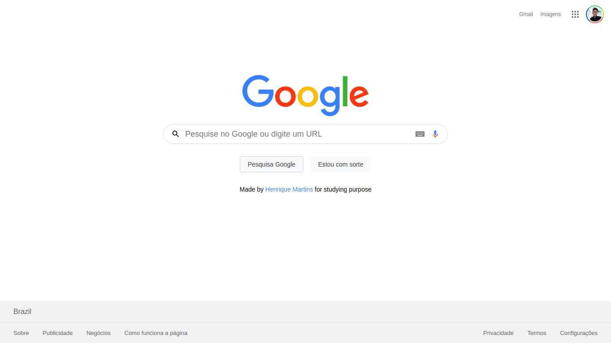

<div align="center">
  <h1>GoogleUI Clone</h1>
  <p>Clone the main Google page</p>
  <p>
    
    <a href="https://www.linkedin.com/in/henrique-martins-5b2bb71a5/" target="_blank" rel="noopener noreferrer">
      
    </a>          
    
  </p>
</div>

# 👀 About

I recreated the main Google study related page. I was interested in applying First Mobile Development, studying more about position and some accessibility properties in CSS, always keeping everything responsive.

<div align="center">
   
</div>

<br>
<br>


# 🚀 Technologies

  - HTML
  - CSS


## 💻 Getting started

### Requirements

- [Git](https://git-scm.com)

### Installing and running the project

*Clone the project and access the folder*

```bash
$ git clone https://github.com/hmartiins/googleuiclone 
$ cd googleuiclone
```

*Follow the steps below*

```bash
# Open index.html in your favorite browser
$ google-chrome index.html

# Well done, Google Clone is started!
```
<br>

## 📝 License

This project is licensed under the MIT License - see the [LICENSE](LICENSE) file for details.

<hr>
<div align="center">
  <sub>Copyright © 2021-present, hmartiins.</sub>
</div>
<hr>
